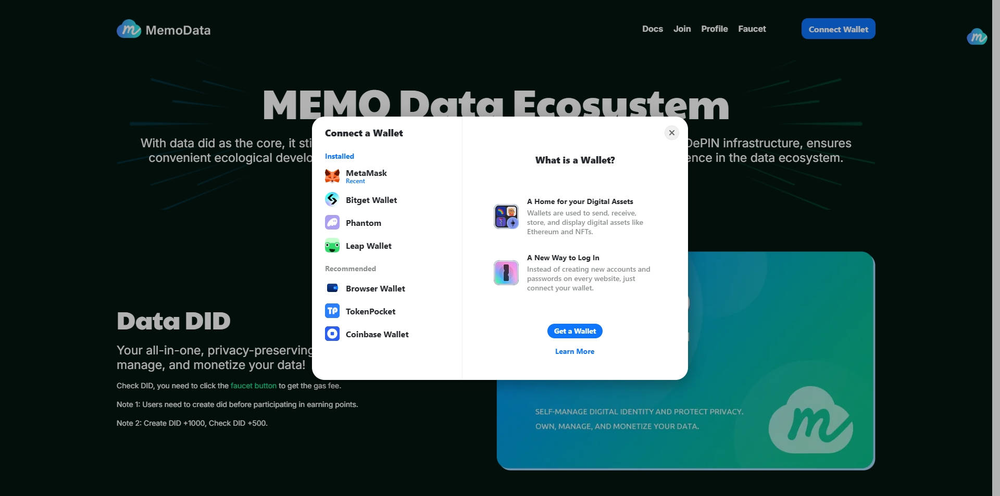
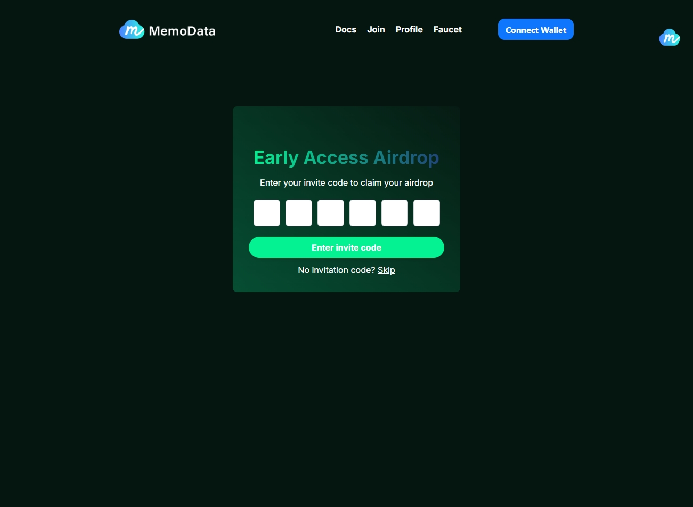
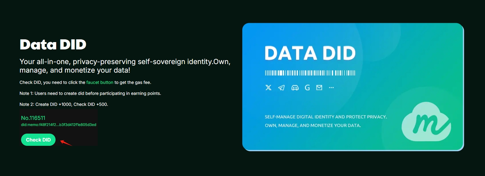
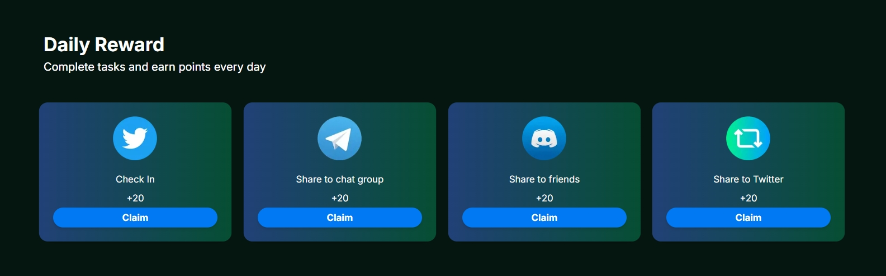
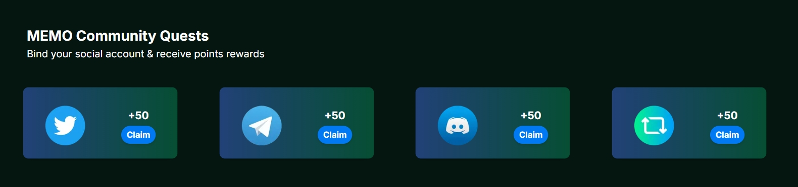
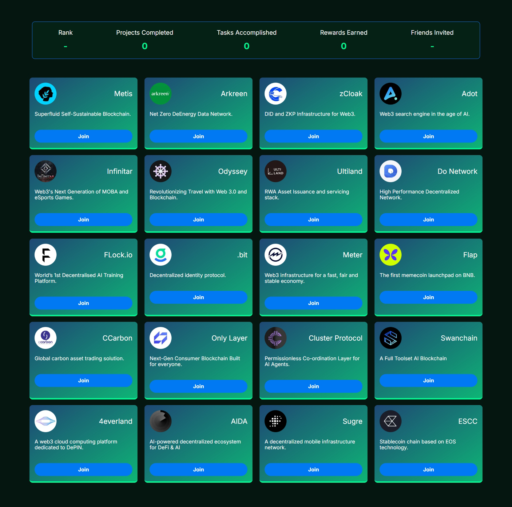

# MemoData Documentation

## 1. MemoData

### 1.1 Introduction

MemoData is a data ecosystem developed by MemoLabs, built on blockchain technology. It is dedicated to **data privacy protection, assetization, and user autonomy**. Its core product, the **MEMO Data Wallet**, provides decentralized, cross-platform digital identity management while establishing a **user-controlled data assetization platform** that ensures privacy security and value circulation. By integrating identity authentication and data trading functions, MemoData constructs a **decentralized digital identity system and data infrastructure**, empowering users with true **data sovereignty** and enabling secure, efficient data value exchange.

### 1.2 Core Components

#### mDID-Decentralized Identity for Accounts

* Generates a unique **on-chain account DID** without reliance on centralized registration or verification.

* Users fully control identity data, supporting **privacy protection** (e.g., selective disclosure) and **cross-platform authentication**.

#### mfileDID - Decentralized Identity for Files

* **Data Ownership & Traceability**: Assigns a unique mfileDID to files/data, enabling on-chain ownership records and transaction tracking.

* **Data Monetization**: Users can store, authorize access, or trade data assets, creating an economic model for personal data rights.

* **Data Functions**: Enables **read, write, purchase, and sharing** of data, fully controlled by the owner (account DID).

### 1.3 Ecosystem Features

* **User Sovereignty**: Ownership of identity and data resides with users, breaking traditional platform monopolies.

* **Assetization Tools**: Transforms data into tradable digital assets via **mDID** and **mfileDID**.

* **Open Collaboration**: Serves as a **Web3 foundational protocol**, allowing developers and third-party ecosystems to integrate.

### 1.4 Technical Implementation

* **Storage Layer**: Uses **MEMOLABS’ decentralized storage system (mefs)** for secure, private storage with customizable solutions.

* **Control Layer**: Blockchain-based **decentralized identity protocol (mDID)** and **data certification layer (mfileDID)**.

* **Application Layer**: Integrates identity management, asset trading, and DApp interactions via the **Data Wallet.**

* **Expansion Layer**: Incentivizes users with rewards and partners (e.g., **XSpace**) to expand storage, use cases, and adoption.
  
### 1.5 Core Value

MemoData addresses **data monopolies** in Web2/Web3 by enabling **true ownership of digital identity and data** through blockchain. It supports **authentication, storage, and trading markets**, positioning itself as **key Web3 infrastructure**.

## 2. User Guide

### 2.1 Quick Start

a. Visit the [website](https://data.memolabs.org/)

b. **Connect Wallet** (See image below).

c. **Enter Referral Code** (Optional):

* Get codes from Twitter/Discord or skip and bind later via **Profile**.

* **Reward**: 500 points for binding.

### 2.2 Create a DID

Click "**Create DID Free**" for instant setup.

    **Note**: Currently free (sponsored by MemoData). Later, users must cover **gas fees**.

    **Important**: Tasks and points are tied to DID—complete this first!

### 2.3 Earn Points

a. **Create DID**: +1,000 pts

b. **Visit Faucet Page**: +500 pts

c. **One-Time Tasks**

d. **Community Tasks**

e. **Partner Campaigns**

f. **Referrals**: +200 pts per new user using your code.

g. **Galxe OAT Rewards**: Redeem 200 pts per OAT.

h. **Ton Mini-App**: [Telegram Bot](https://t.me/tondid_bot)

i. **More**: Follow [MEMO Twitter](https://x.com/MemoLabsOrg).

### 2.4 Profile

Displays **DID**, **wallet info**, and allows **invite code binding** (if skipped earlier).

### 2.5 Faucet

Get gas fees: [Faucet Link](https://faucet.metamemo.one/?address=0xd40a4c01e12D19D85F9C32Fe1F88495850E7F180).

### 2.6 Join the Ecosystem

Partners can apply via [this form](https://docs.google.com/forms/d/e/1FAIpQLSfyrgViv6ABqLV_1pcGoqnQuF1dAQs8igIQWOunrCEFhg8RgQ/viewform).

## 3. MemoData Ecosystem

### 3.1 Data Wallet (Coming Soon)

A **cross-chain asset hub** for managing data, trading, and DeFi integration. Features **smart contract payouts** for contributors.

### 3.2 XSpace

A decentralized AI data collaboration platform [XSpace](https://xspace.memolabs.net/). Users earn rewards for sharing public social data (e.g., Twitter), feeding AI training.

### 3.3 Data Marketplace (Coming Soon)

Decentralized trading with **DID-based ownership** and **ZK-proof privacy**.

### 3.4 Drive3

Decentralized storage [Drive3](https://drive3.net/)using **MEFS/RAFI tech**. Supports **copyrighted data sales** via marketplace.

### 3.5 Partners

Collaborating with **Infinitar, Swaichain, and 20+ projects** on storage, security, and cross-chain identity.  

## 4. FAQ

### 4.1 How to Register a DID?

a. Go to [MemoData](https://data.memolabs.org/)

b. Connect wallet.

c. Click "**Create DID Free**".

    **Note**: Free for a limited time—later requires gas fees.

### 4.2 Benefits of DataDID?

* **Identity Verification**：Required for ecosystem activities.

* **Points**：Redeemable for **SBTs**.

* **Free Storage**：For XSpace, NFT minting, etc.

* **Future Access**：Data wallets & marketplaces.

### 4.3 What Are Points For?

Exchangeable for SBTs (ratio TBA). More points = more SBTs.

### 4.4 How to Earn More Points?

Follow [MEMO Twitter](https://x.com/MemoLabsOrg) and [Telegram](https://t.me/memolabsio) for campaigns.

## 5. Links

### 5.1 DataDID

[Website](https://data.memolabs.org/)

[Download extension](https://chromewebstore.google.com/detail/xspace/mklejljmlgjnknaodkikbmcbpbmabdfo?hl=zh-CN&utm_source=ext_sidebar)

### 5.2 MEMO

[Website](https://memolabs.org/)

[Twitter](https://x.com/MemoLabsOrg)

[Discord](https://discord.com/invite/YG4Ydv2E7X)

[Telegram](https://t.me/memolabsio)

[Medium](https://memolabs.medium.com/)

[Galxe](https://app.galxe.com/quest/MemoLabsOrg)
