# MemoData Doc

## 1. MemoData

### 1.1 介绍

MemoData 是由 Memolabs 打造的数据生态系统，基于区块链技术构建，致力于实现数据隐私保护、资产化和用户自主权。其核心产品 MEMO数据钱包不仅提供去中心化、跨平台的数字身份管理，更打造了一个由用户完全掌控的数据资产化平台，确保隐私安全与价值流转。通过整合身份认证与数据交易功能，MemoData 构建了去中心化的数字身份体系与数据基础设施，让用户真正掌握数据主权，推动安全、高效的数据价值流通。

### 1.2 核心组成

#### mDID-账户去中心化身份

为用户生成唯一的链上账户 DID，无需依赖中心化机构注册或验证。

用户完全掌控身份数据，支持隐私保护（如选择性信息披露）及跨平台身份认证。

#### mfileDID - 文件去中心化身份  

* 数据确权与追踪

通过 mfileDID 为文件/数据赋予唯一标识，实现所有权链上存证与流转追踪。

* 数据价值化

支持用户存储、授权访问或交易数据资产，构建个人数据权益的经济模型。

* 数据附属功能

赋予数据读、写、购买、分享的功能，且由数据的owner（账户DID）完全控制。

### 1.3 生态系统特点

用户主权：身份与数据所有权归用户所有，打破传统中心化平台垄断。

资产化工具：通过 mDID 与 File DID 将数据转化为可交易的数字资产。

开放协作：作为Web3基础协议，支持开发者与第三方生态接入。

### 1.4 技术实现路径

存储层：基于MEMOLABS实现的分散式存储系统mefs，实现数据隐私和安全存储。并可根据用户喜好定制不同对接方案。

控制层：基于区块链构建去中心化身份协议（账户DID）与数据存证层（File DID）。

应用层：通过数据钱包整合身份管理、资产交易、DApp交互等功能。

扩展层：通过积分激励与合作伙伴（如XSpace）扩展存储、应用场景及用户规模。
  
### 1.5 核心价值

MemoData 旨在解决 Web2、Web3 时代的数据垄断问题，通过区块链技术让用户真正拥有数字身份与数据的控制权，推动隐私保护与数据价值回归个人。其扩展性涵盖身份认证、数据存储、交易市场等场景，是 Web3 生态的关键基础设施。

## 2. 用户指南

### 2.1 快速开始

a. 访问[网站](https://data.memolabs.org/)

b.连接钱包
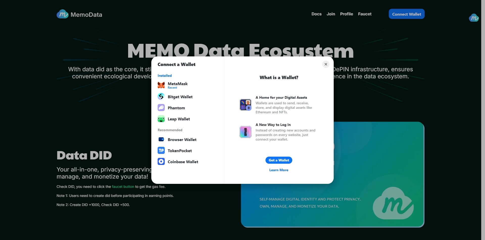

c.输入推荐邀请码

通过 Twitter、Discord 或其他社交媒体查找邀请码，输入即可；

没有邀请码，可以先跳过，后续在获取到邀请码之后，通过Profile进行邀请码的绑定；

用户绑定邀请码可以获得500积分奖励；
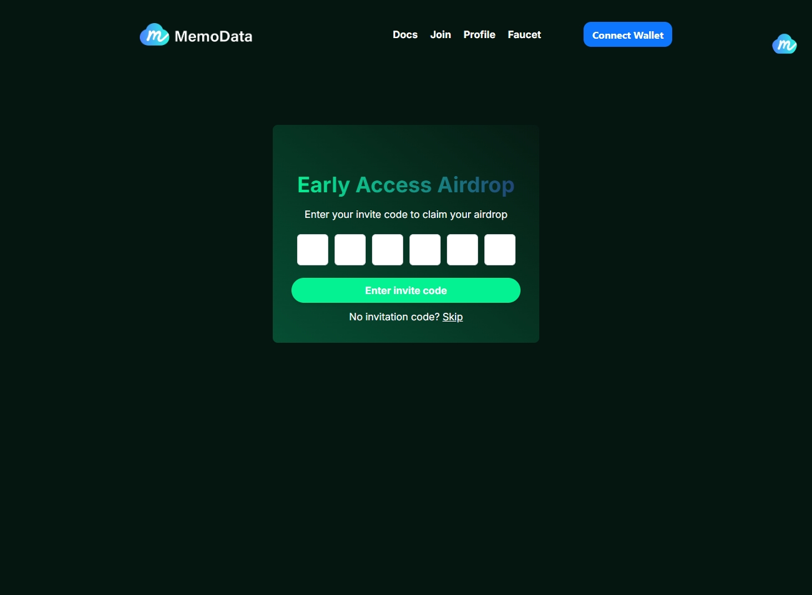

### 2.2 创建DID

直接点击`Create DID Free`，一键创建。
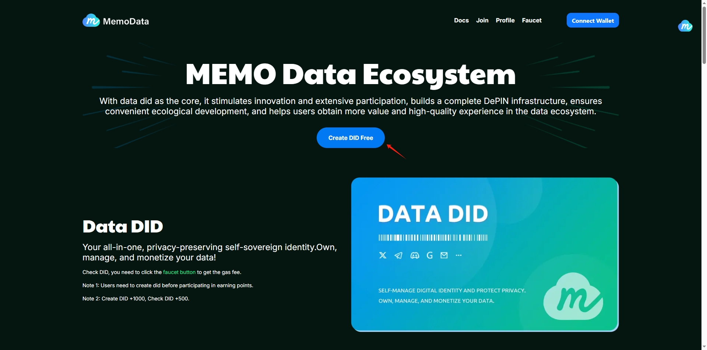

    注：现阶段DID可以委托项目方进行免费创建，后期DID需要用户自行创建且需要负担创建DID所需的Gas fee。

    注：后续的任务积分都会与DID进行绑定，所以在做任务前请先连接钱包、创建DID；

### 2.3 获取积分

a.创建DID +1000积分；
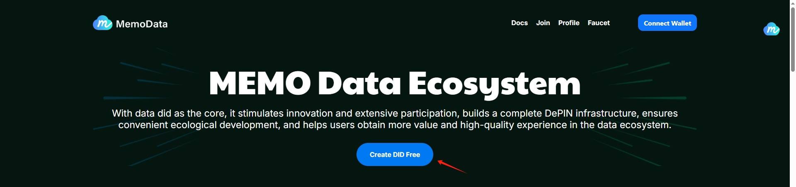

b.访问水龙头页面 +500积分；
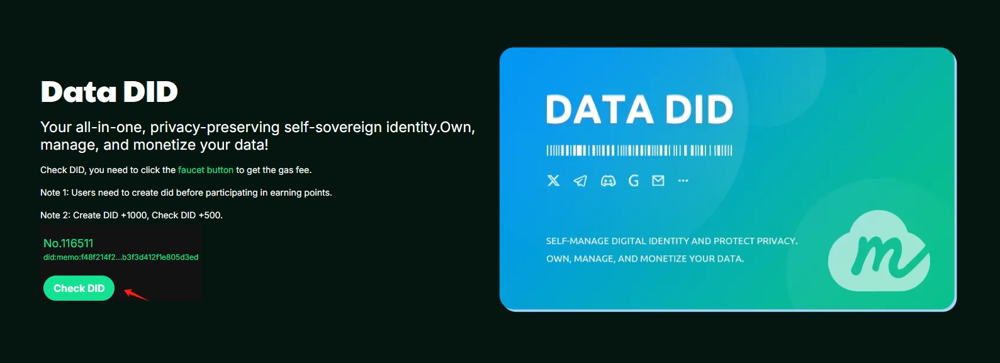

c.一次性任务
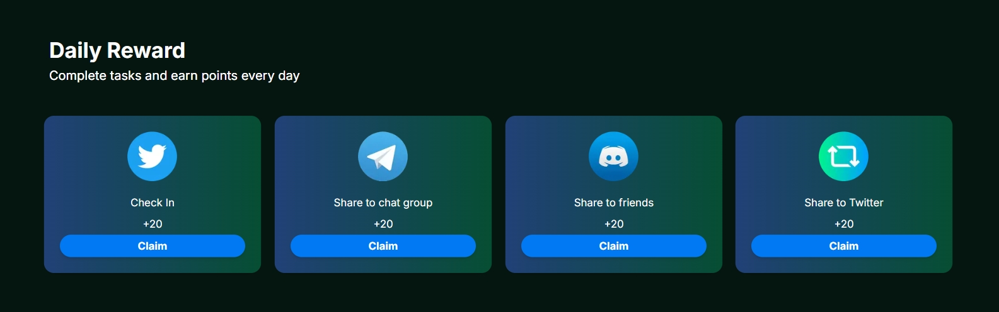

d.社区任务
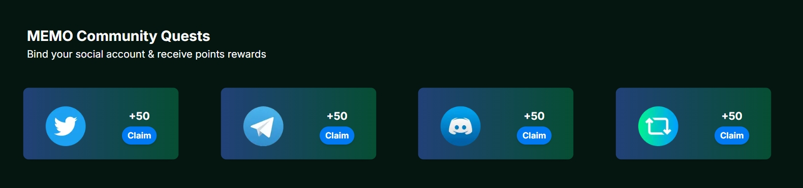

e.项目方联合活动
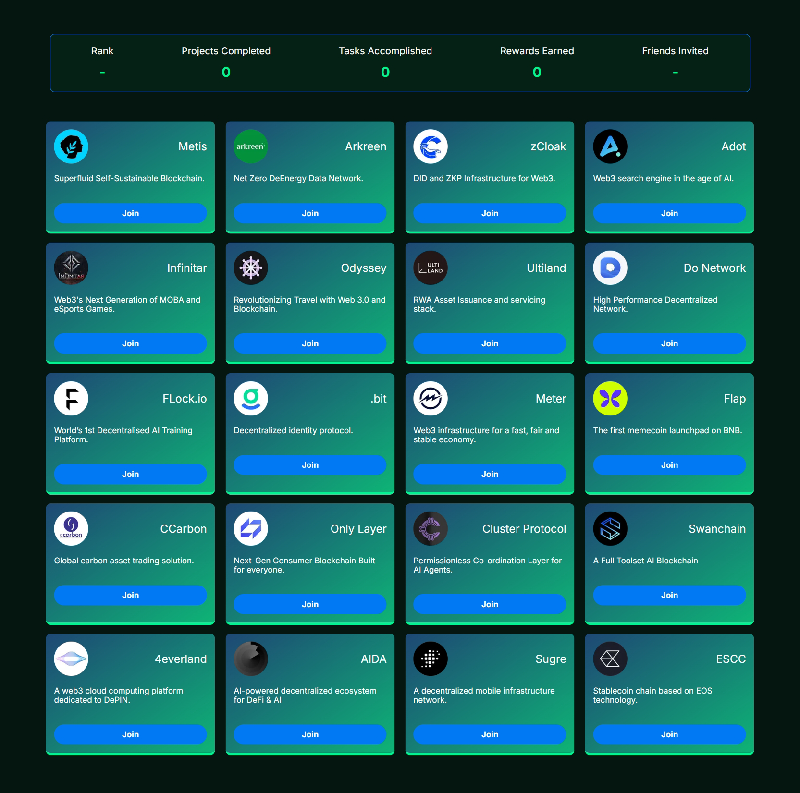

f.邀请新用户

    注：分享邀请码或邀请链接，新用户绑定你的邀请码，你将获得200积分；
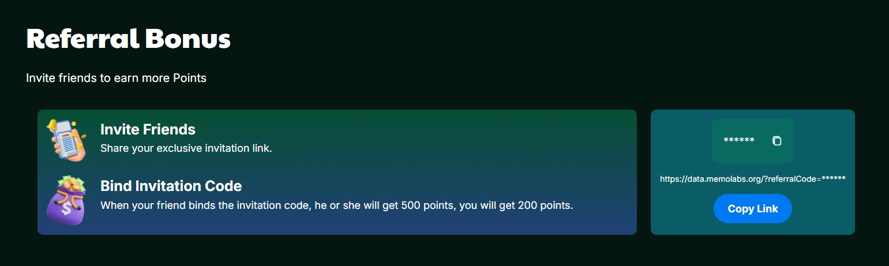

g.Galxe平台OAT活动

    注：前期参与联合活动领取到OAT的用户现在可以兑换OAT积分奖励，一个OAT可以兑换200积分；

h.[Ton小程序](https://t.me/tondid_bot)
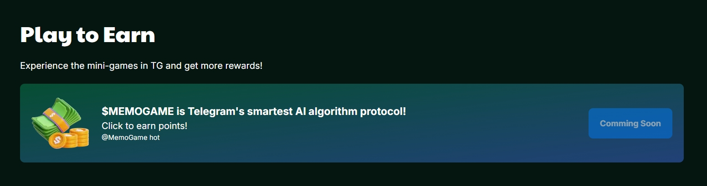

i.更多获取积分的途径，请关注 [MEMO推特账号](https://x.com/MemoLabsOrg)

### 2.4 Profile

展示DID、DID编号、钱包地址信息，前期没有绑定邀请码的用户可以通过Invite Code绑定邀请码，双方都可以获取积分奖励。
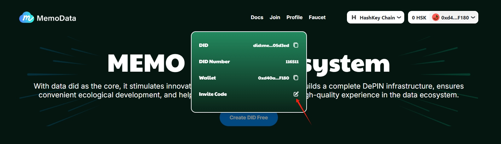

### 2.5 Faucet

访问 [水龙头](https://faucet.metamemo.one/?address=0xd40a4c01e12D19D85F9C32Fe1F88495850E7F180) 页面领取 Gas fee;

### 2.6 Join

有意向与MEMO共建数据生态的项目方，可通过填写 [表单](https://docs.google.com/forms/d/e/1FAIpQLSfyrgViv6ABqLV_1pcGoqnQuF1dAQs8igIQWOunrCEFhg8RgQ/viewform) 与MEMO沟通合作相关事宜。

## 3. MemoData生态项目

### 3.1 数据钱包(待上线)

**MEMO数据钱包**是生态的资产中枢，支持跨链数据资产管理，无缝对接交易市场与 DeFi。用户可通过钱包统一管理数据资产、查看收益，并利用智能合约实现自动化分账，确保贡献者即时获得回报。

### 3.2 XSpace

[XSpace](https://xspace.memolabs.net/) 是基于区块链的去中心化AI数据协作平台，致力于打破数据垄断，重构数据价值分配体系。通过浏览器插件，用户可一键采集 Twitter 等社交媒体公开数据并获得奖励，同时为 AI开发者提供高质量、可追溯的训练数据。  

### 3.3 数据交易市场 (待上线)

**MEMO数据交易市场**采用去中心化架构打造数据流通平台，支持数据资产化，允许用户管理自己的数据，将其上架到交易市场进行流通。所有交易均通过 DID 确权，结合零知识证明技术保障交易隐私。

### 3.4 Drive3

[Drive3](https://drive3.net/) 是基于MEFS协议的分散式存储网盘，采用RAFI技术确保提供高可用加密存储，并支持数据版权认证。用户可存储个人文件或XSpace采集的AI训练数据，一键上架至交易市场变现，形成“存储-确权-交易”闭环。

### 3.5 生态合作项目

**MemoData**已与Infinitar、Swaichain等20+优质项目达成战略合作，共同构建覆盖数据存储与安全、跨链身份互通、DApp生态共建等领域的去中心化数据生态，推动DID与数据资产化技术落地应用。我们将持续扩展合作网络，加速实现Web3时代的数据主权与价值流通。  

## 4. 常见问题

### 4.1 如何注册DID?

a. 访问 [Memo Data 网站](https://data.memolabs.org/)

b.连接钱包

c.点击按钮`Create DID Free`

    注：现阶段平台可协助免费创建DID，限时免费活动结束后，用户则需要自行创建DID且承担创建DID所需要的费用。

### 4.2 注册DataDID，可以获得哪些权益？

**身份确认**：只有 DID 用户才能参与MEMO生态活动；

**积分奖励**：参与活动积累积分，积分可兑换 SBT；

**免费存储空间**：支持XSpace，免费获取存储空间，参与Mint NFT与XSpace平台活动；

**未来支持数据交易市场 & 数据钱包**：完全自主管理、存储和交易数据；

简单说，DataDID 不仅是 Web3 中的身份证明，还是数据的确权代表，为用户带来更多功能与权益。

### 4.3 积分有什么用？

积分后期可兑换 SBT，具体的兑换比例晚些时候公布。用户获取的积分越多，可以兑换的SBT越多。

### 4.4 额外获取积分的途径？

不定期推出的活动都会在 [MEMO推特账号](https://x.com/MemoLabsOrg) 与 [TG群](https://t.me/memolabsio) 发布，请关注官方账号，获取第一手活动信息。

## 5. 链接

### 5.1 DataDID

[Website](https://data.memolabs.org/)

[Download extension](https://chromewebstore.google.com/detail/xspace/mklejljmlgjnknaodkikbmcbpbmabdfo?hl=zh-CN&utm_source=ext_sidebar)

### 5.2 MEMO

[Website](https://memolabs.org/)

[Twitter](https://x.com/MemoLabsOrg) 

[Discord](https://discord.com/invite/YG4Ydv2E7X)

[Telegram](https://t.me/memolabsio)

[Medium](https://memolabs.medium.com/)

[Galxe](https://app.galxe.com/quest/MemoLabsOrg)
